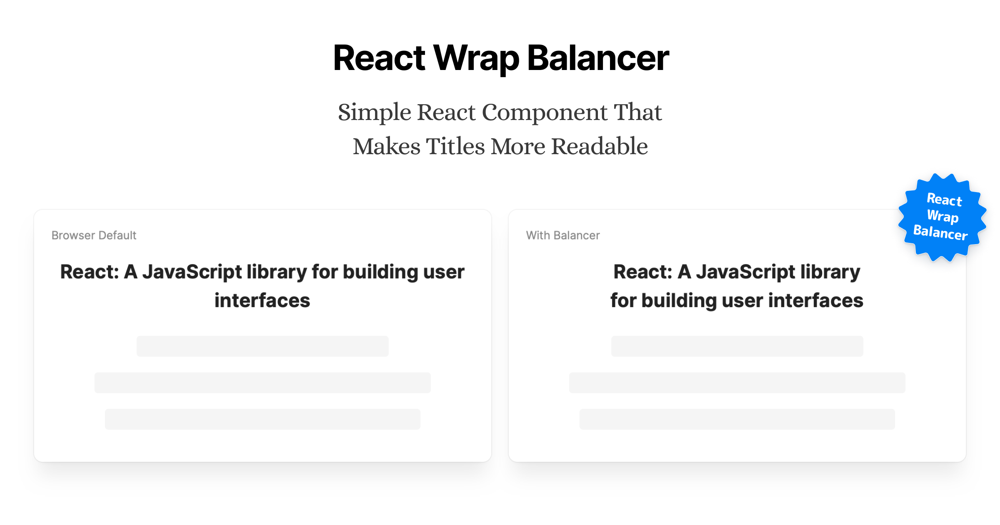
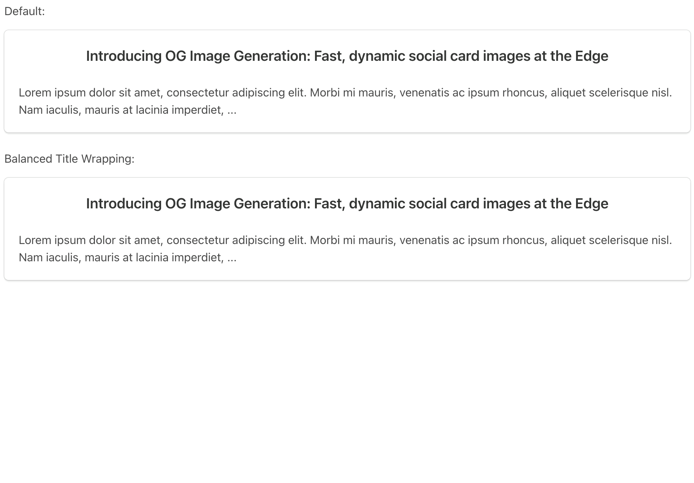

[](https://react-wrap-balancer.vercel.app)

## Introduction

[**React Wrap Balancer**](https://react-wrap-balancer.vercel.app) is a simple React Component that makes your titles more readable in different viewport sizes. It improves the wrapping to avoid situations like single word in the last line, makes the content more “balanced”:



## Usage

To start using the library, install it to your project:

```bash
npm i react-wrap-balancer
```

And wrap text content with it:

```jsx
import Balancer from 'react-wrap-balancer'

// ...

function Title() {
  return (
    <h1>
      <Balancer>My Awesome Title</Balancer>
    </h1>
  )
}
```

If you have multiple `<Balancer>` components used, it’s recommended (but optional) to also use
`<Provider>` to wrap the entire app. This will make them share the re-balance logic and reduce the HTML size:

```jsx
import { Provider } from 'react-wrap-balancer'

// ...

function App() {
  return (
    <Provider>
      <MyApp/>
    </Provider>
  )
}
```

For full documentation and use cases, please visit [**react-wrap-balancer.vercel.app**](https://react-wrap-balancer.vercel.app).

## About

This project was inspired by Adobe’s [balance-text](https://github.com/adobe/balance-text) project, NYT’s [text-balancer](https://github.com/nytimes/text-balancer) project, and Daniel Aleksandersen’s [Improving the New York Times’ line wrap balancer](https://www.ctrl.blog/entry/text-wrap-balance.html). If you want to learn more, you can also take a look at the [text-wrap: balance](https://drafts.csswg.org/css-text-4/#text-wrap) proposal.

Special thanks to [Emil Kowalski](https://twitter.com/emilkowalski_) for testing and feedback.

Created by [Shu Ding](https://twitter.com/shuding_) in 2022, released under the MIT license.

<a aria-label="Vercel logo" href="https://vercel.com">
  
</a>
